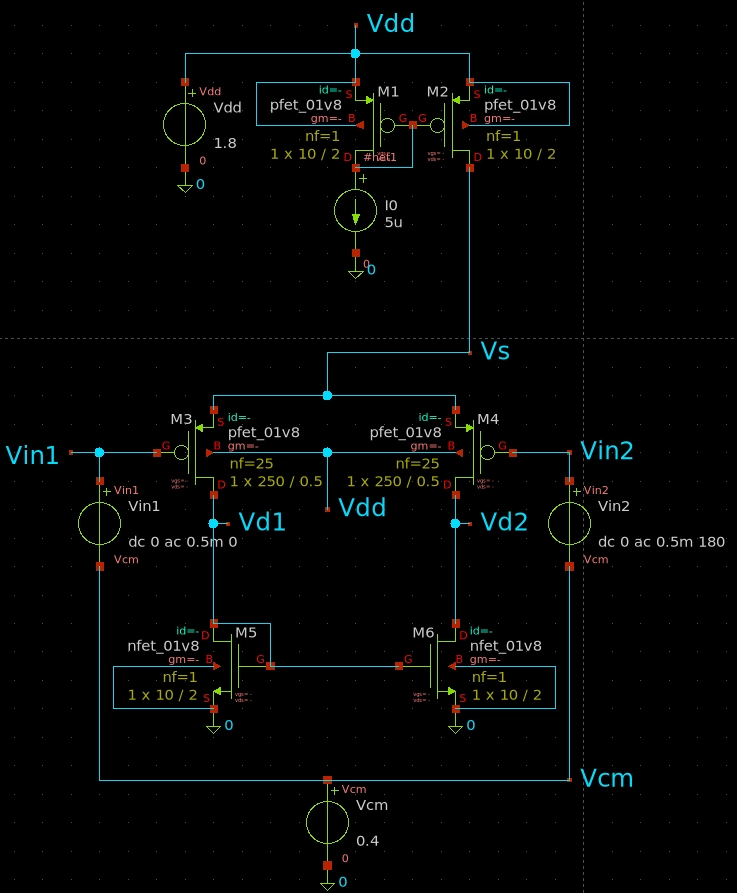
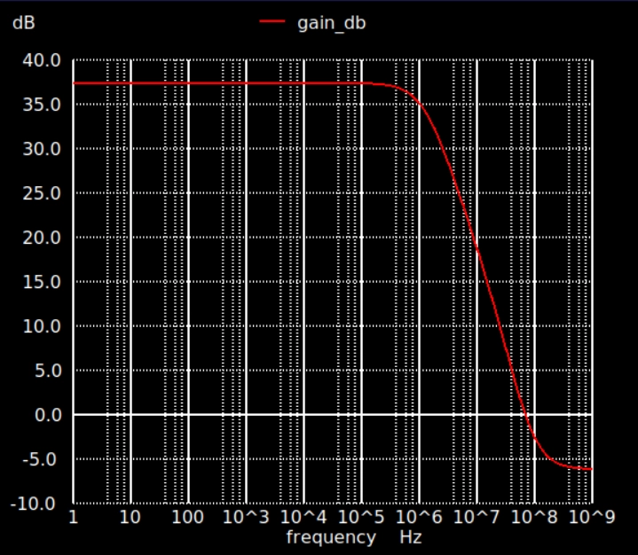
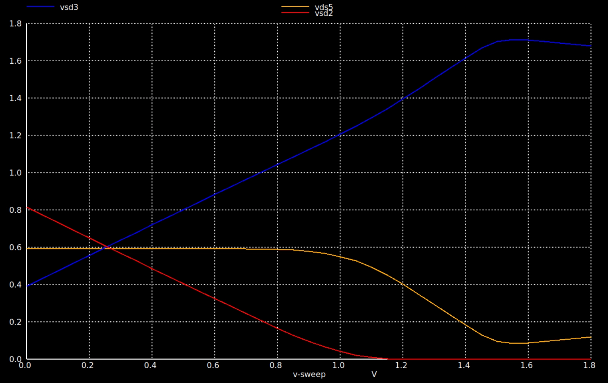

# Low-Power CMOS Op-Amp Design

**Portfolio Documentation**: [Link to my Notion](https://nabeelsonaseth.notion.site/Low-Power-CMOS-Op-Amp-Design)

**SkyWater SKY130 · Xschem · Ngspice · IIC-OSIC Docker**

In-progress design of a low-power two-stage CMOS op-amp in the SkyWater 130 nm process.

The current milestone is a six-transistor first gain stage consisting of a **PMOS differential pair**, **NMOS current-mirror active load**, and **PMOS current-mirror bias network**. Device sizing was guided by SKY130 gm/ID characterization, branch-current targets, and iterative headroom/compliance analysis.

## Current First-Stage Results

| Metric | Result |
| --- | ---: |
| Supply | 1.8 V |
| Nominal common-mode voltage | 0.4 V |
| Differential gain | 37.39 dB |
| -3 dB bandwidth | 1.195 MHz |
| Input common-mode range | ≈ 0–0.775 V |
| DC power | < 18 µW |

## First-Stage Schematic



The current first stage uses a PMOS differential input pair with an NMOS current-mirror active load for differential-to-single-ended conversion and a PMOS current mirror for biasing.

## Design Highlights

- Built dedicated SKY130 **NMOS and PMOS gm/ID characterization testbenches** and generated gm/ID versus ID/W reference curves for transistor sizing.
- Sized the PMOS input pair for approximately **2.5 µA per branch** at a target gm/ID of approximately **18–20 V⁻¹**.
- Characterized device compliance and headroom using standalone Stage 1 testbenches before validating the resulting voltage distribution in the integrated amplifier.
- Increased PMOS current-source channel length to reduce channel-length modulation and improve mirror accuracy.
- Integrated a **1:1 NMOS current-mirror active load** and verified approximately **37.4 dB** differential voltage gain using AC small-signal analysis.
- Swept input common-mode voltage while tracking branch currents, mirror accuracy, and device headroom to identify the **PMOS bias source as the upper-ICMR limiting device**.

## Nominal AC Response



At the nominal common-mode bias of **VCM = 0.4 V**, the standalone first stage achieves **37.39 dB low-frequency differential gain** and a **1.195 MHz -3 dB bandwidth**.

## Headroom and Common-Mode Characterization



A full-stage common-mode sweep was used to track voltage redistribution through the transistor stack. Through most of the usable input range, the NMOS active load remains near its nominal operating voltage while increasing VCM transfers headroom from the upper PMOS bias source to the PMOS differential pair.

The PMOS bias source eventually reaches the compliance region identified during standalone characterization. Using **95% PMOS bias-current accuracy** as the formal upper boundary, the measured input common-mode range is approximately **0–0.775 V**.

## Repository Structure

```text
characterization/
├── schematics/      SKY130 NMOS/PMOS device-characterization testbenches
└── results/         gm/ID versus ID/W characterization plots

stage1/
├── schematics/      First-stage design progression
├── testbenches/     Device headroom/compliance and sizing testbenches
└── results/         First-stage schematics and simulation results

